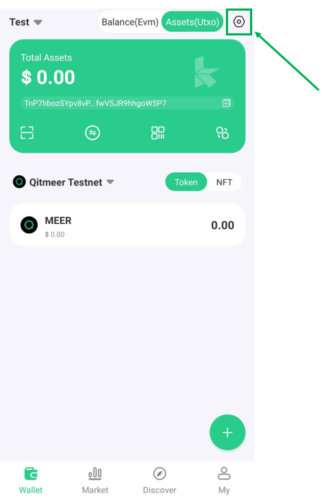

 
## Prerequisites
- Golang (Go) - Download and installation can be found at: https://go.dev/doc/install

## Compile and build MEER node 
- Clone the repository: `git clone https://github.com/Qitmeer/qng.git`
- Enter the `qng` directory: `cd qng`
- Run `make` command

```bash
> git clone https://github.com/Qitmeer/qng.git
> cd qng
> make
```

> Running `make all` will also install <a href="https://github.com/Qitmeer/qng/tree/main/cmd/qx">*qx*</a>, <a href="https://github.com/Qitmeer/qng/tree/main/cmd/relaynode" >*relay*</a> and *<a href="https://github.com/Qitmeer/qng/tree/main/cmd/fastibd">fastIBD</a>*

## Install *qx*
*qx* is a command-line tool and can be regarded as the “Swiss Army Knife of Qitmeer”. It can provide a range of functionalities such as: random seed generation, public/private key generation, constructing transactions etc.

#### Installation Instructions: 
> This process can be skipped if you ran the `make all` command in the previous section.

- Enter the `qng/cmd/qx` directory: `cd qng/cmd/qx`
- Run `go build` (you may have to run `go mod tidy` if you run into issues regarding dependencies)
- To run the tool, simply type `./qx`

```bash
> cd qng/cmd/qx
> go build
> ./qx
```
> Installation of *qx* is not mandatory but may prove to be useful to complete certain tasks


## Create Wallet (KAHF Wallet)

- Download and install the app KAHF wallet available at: https://www.kahf.io/. KAHF is a multi-chain wallet that provides a user-friendly GUI to manage all your digital assets. After following the instructions on-screen, ensure that *Qitmeer Testnet* is also selected in order to manage assets in the Qitmeer test network environment.

#### Export Private Key
Using the app, you will also be able to export your private key:

1) Click on the icon on the top-right hand corner:



2) Select *Check Private Key* and enter in your password
3) Select *Qitmeer Testnet Assets (UTXO)*
4) Your private key should now be displayed. You also have the option to press *Copy* to copy to your clipboard


## Create Wallet (Using *qx*)

You can use the *qx* command line to generate your own wallet:

- Enter the directory where you have placed the qx binary file (if you followed the previous instructions above, this should be at `qng/cmd/qx`
- Generate a cryptographic secure pseudo-random entropy (seed) using the command `./qx entropy`

```bash
> ./qx entropy
Output: 91b69389c7df9aad1bbb58b0667f322165b965f16184aa613ee4792e27b9be28
```

To produce a mnemonic word-list (<a href="https://github.com/bitcoin/bips/blob/master/bip-0039.mediawiki" >BIP39</a>) enter the command:

```bash
> ./qx mnemonic-new 91b69389c7df9aad1bbb58b0667f322165b965f16184aa613ee4792e27b9be28
Output: museum region tiny moral whale final humble help race crop smart drift fortune real sheriff correct price antique ribbon venture tiny system weather all
```
With this mnemonic, you can export your wallet to KAHF wallet or any other compatible wallet.


Use the following commands to generate the *Private Key*, *Public Key*, *Address*, *Public Key (PK) Address* and *ETH Address*:

> **WARNING**: The entropy and other values generated here, exist purely for demonstration purposes. **These values should only be used in a test environment and not used to hold assets with real monetary value.**

*Private Key*:
```bash
> ./qx mnemonic-new <entropy> | ./qx mnemonic-to-seed | ./qx ec-new
> ./qx mnemonic-new 91b69389c7df9aad1bbb58b0667f322165b965f16184aa613ee4792e27b9be28 | ./qx mnemonic-to-seed | ./qx ec-new
Output: 12d76cda3b0d4dde6c8cad7f0df2ceb5b1690b4f3725f94226095cf04d3f21e2
```
*Public Key*:
```bash
> ./qx mnemonic-new <entropy> | ./qx mnemonic-to-seed | ./qx ec-new | ./qx ec-to-public
> ./qx mnemonic-new 91b69389c7df9aad1bbb58b0667f322165b965f16184aa613ee4792e27b9be28 | ./qx mnemonic-to-seed | ./qx ec-new | ./qx ec-to-public
Output: 0363e43e0dfda44a34e1653f4feeb487fa8ccb88ba5b975a888913190e4a94abcd
```
*Address*:
```bash
> ./qx mnemonic-new <entropy> | ./qx mnemonic-to-seed | ./qx ec-new | ./qx ec-to-public | ./qx ec-to-addr -v <network>
> ./qx mnemonic-new 91b69389c7df9aad1bbb58b0667f322165b965f16184aa613ee4792e27b9be28 | ./qx mnemonic-to-seed | ./qx ec-new | ./qx ec-to-public | ./qx ec-to-addr -v testnet
Output: TnP7hbozSYpv8vPzHFnVfwVSJR9hhgoW5P7
```
*Public Key Address*:
```bash
> ./qx mnemonic-new <entropy> | ./qx mnemonic-to-seed | ./qx ec-new | ./qx ec-to-public | ./qx ec-to-pkaddr -v testnet
> ./qx mnemonic-new 91b69389c7df9aad1bbb58b0667f322165b965f16184aa613ee4792e27b9be28 | ./qx mnemonic-to-seed | ./qx ec-new | ./qx ec-to-public | ./qx ec-to-pkaddr -v testnet
Output: Tk6ts4JPqiyS5Xn1Jh9XmjADDtnBMDpoDCbcMKV2FkeGqjDJb1azt
```
> The `-v` flag represents the type of network. By default this is set to "mainnet". 

*ETH Address* (for use in MeerEVM):
```bash
> ./qx mnemonic-new <entropy> | ./qx mnemonic-to-seed | ./qx ec-new | ./qx ec-to-public | ./qx ec-to-ethaddr
> ./qx mnemonic-new 91b69389c7df9aad1bbb58b0667f322165b965f16184aa613ee4792e27b9be28 | ./qx mnemonic-to-seed | ./qx ec-new | ./qx ec-to-public | ./qx ec-to-ethaddr
Output: 0x86209f32b6490Ca551b09fb4c8f70B79f513cF73
```

### Commands List:
- `mnemonic-new`:  create a mnemonic word-list (<a href="https://github.com/bitcoin/bips/blob/master/bip-0039.mediawiki" >BIP39</a>) from an entropy
- `mnemonic-to-seed`: convert a mnemonic word-list (<a href="https://github.com/bitcoin/bips/blob/master/bip-0039.mediawiki" >BIP39</a>) to its 512 bits seed
- `ec-new`: create a new Elliptic Curve (EC) private key from an entropy (seed)
- `ec-to-public`: derive the EC public key from a EC private key
- `ec-to-addr`:  convert an EC public key to a payment address
- `ec-to-pkaddr`: convert an EC public key to a payment public key address
- `ec-to-ethaddr`: convert an EC public key to a Ethereum address


## Mining Test Coins
There are several ways in which to mine MEER test coins for use in the Qitmeer testnet. Regardless of which method is used, the MEER node must have the `--miner` flag enabled as well as `--miningaddr=<block-reward-address>`. 

> If the block reward were to be sent to address "TnSh92n7s4XbRiPmNrtYDttMugLVycsuars", then the flag would be `--miningaddr=TnSh92n7s4XbRiPmNrtYDttMugLVycsuars`. Both the address and PK address can be used when setting this flag.

These include: 
- Inserting the `--generate` flag before running the MEER node. `./qng –-testnet –-mining –-miningaddr=<block-reward-address> –-generate`. This method is the easiest to implement and will attempt to mine blocks using the onboard CPU. 
- Installing and running the *<a href="https://github.com/Qitmeer/qitmeer-miner">qitmeer-miner</a>*. This method provides a greater level of control of the mining process allowing users to utilise their GPU for mining instead of their CPU, participate as a solo miner or as part of a pool etc

Once you have successfully received miner reward and obtained some test coins, you can view the balance of your account on the <a href="https://testnet.meerscan.io/">Qitmeer BlockDAG Explorer Testnet</a> or <a href="https://www.kahf.io/">KAHF Wallet</a>. 

